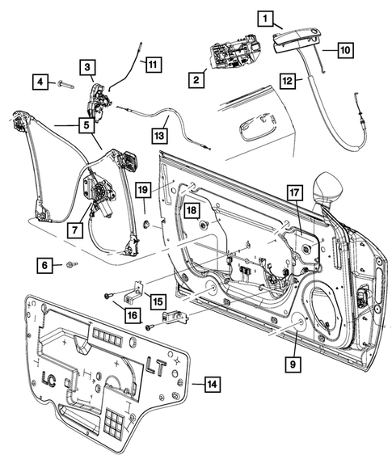
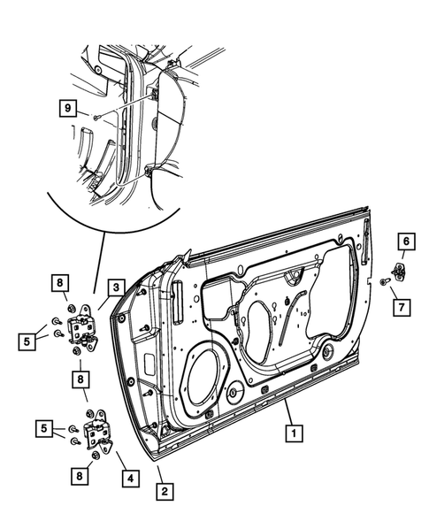
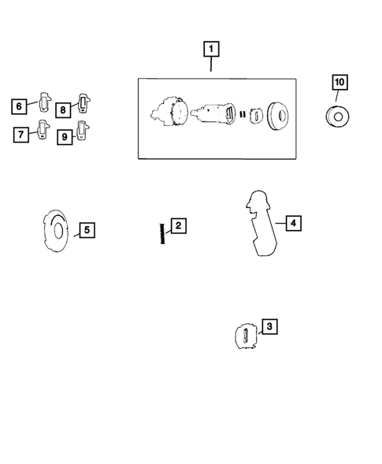
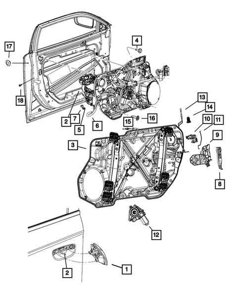
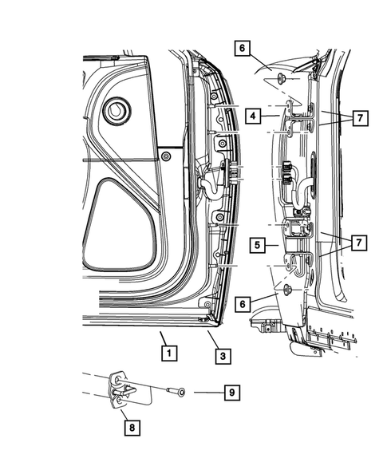
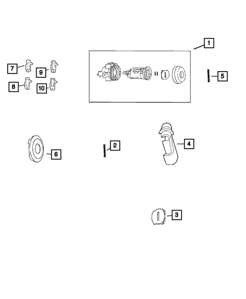

# ADR 2/01 Side-Door Latch and Hinge Similarity Supplement
**2017 Dodge Challenger variants versus 2017 Dodge Charger variants**
**Date:** 2026-07-31
**Status:** FUNCTIONAL-ARCHITECTURE PASS under broad variant/trim criterion; exact core latch/hinge part-number equivalence not established

## Executive determination
- **PASS — functional similarity:** all 12 screened Challenger/Charger variant-pair combinations contain corresponding left/right front-door latch architecture; lower left/right hinge pairs were also identified by OEM part listings.
- **VERIFIED:** 613 front-door catalog rows, 52 direct latch/attaching-hardware rows, 21 exploded-diagram records and zero scraper errors.
- **VERIFIED:** 26 exact shared exterior-handle part numbers support common door-control architecture.
- **LIMIT:** no exact common OEM service part number was established for the core Challenger-versus-Charger latch or lower-hinge assemblies. The coupes and sedans use different core service numbers.
- **ADR LIMIT:** this supports an ADR 2/01 component-architecture similarity argument only. It does not prove latch/hinge strength, longitudinal/transverse load performance, installed configuration, or ADR compliance.

## Comparison rule used
At the user’s direction, variants and trims may be mixed. A pair passes if a Challenger variant and a Charger variant expose corresponding component classes and functions, even where the OEM service part numbers differ. Exact matches are reported separately and are not fabricated.

## Functional latch and hinge crosswalk
| Component | Challenger part | Charger part | Match basis | Result |
|---|---|---|---|---|
| Front door latch — right | 68174640AH | 04589916AH | same OEM component class, side and function; different service part number | FUNCTIONAL-SIMILARITY PASS |
| Front door latch — left | 68174641AH | 04589913AI | same OEM component class, side and function; different service part number | FUNCTIONAL-SIMILARITY PASS |
| Front lower door hinge — right | 68026642AC | 68148514AB | same OEM component class, side and lower-hinge function; different service part number | FUNCTIONAL-SIMILARITY PASS |
| Front lower door hinge — left | 68026643AC | 68148515AB | same OEM component class, side and lower-hinge function; different service part number | FUNCTIONAL-SIMILARITY PASS |

## Variant-pair results
| Challenger variant | Charger variant | Exact core PN matches | Functional match | Status |
|---|---|---:|---|---|
| SXT 3.6L | R/T 5.7L | 0 | front door latch left; front door latch right; lower door hinge left; lower door hinge right | FUNCTIONAL-ARCHITECTURE PASS — core service part numbers differ |
| SXT 3.6L | R/T Scat Pack 6.4L | 0 | front door latch left; front door latch right; lower door hinge left; lower door hinge right | FUNCTIONAL-ARCHITECTURE PASS — core service part numbers differ |
| SXT 3.6L | SRT 392 6.4L | 0 | front door latch left; front door latch right; lower door hinge left; lower door hinge right | FUNCTIONAL-ARCHITECTURE PASS — core service part numbers differ |
| R/T 5.7L | R/T 5.7L | 0 | front door latch left; front door latch right; lower door hinge left; lower door hinge right | FUNCTIONAL-ARCHITECTURE PASS — core service part numbers differ |
| R/T 5.7L | R/T Scat Pack 6.4L | 0 | front door latch left; front door latch right; lower door hinge left; lower door hinge right | FUNCTIONAL-ARCHITECTURE PASS — core service part numbers differ |
| R/T 5.7L | SRT 392 6.4L | 0 | front door latch left; front door latch right; lower door hinge left; lower door hinge right | FUNCTIONAL-ARCHITECTURE PASS — core service part numbers differ |
| R/T Scat Pack 6.4L | R/T 5.7L | 0 | front door latch left; front door latch right; lower door hinge left; lower door hinge right | FUNCTIONAL-ARCHITECTURE PASS — core service part numbers differ |
| R/T Scat Pack 6.4L | R/T Scat Pack 6.4L | 0 | front door latch left; front door latch right; lower door hinge left; lower door hinge right | FUNCTIONAL-ARCHITECTURE PASS — core service part numbers differ |
| R/T Scat Pack 6.4L | SRT 392 6.4L | 0 | front door latch left; front door latch right; lower door hinge left; lower door hinge right | FUNCTIONAL-ARCHITECTURE PASS — core service part numbers differ |
| SRT 392 6.4L | R/T 5.7L | 0 | front door latch left; front door latch right; lower door hinge left; lower door hinge right | FUNCTIONAL-ARCHITECTURE PASS — core service part numbers differ |
| SRT 392 6.4L | R/T Scat Pack 6.4L | 0 | front door latch left; front door latch right; lower door hinge left; lower door hinge right | FUNCTIONAL-ARCHITECTURE PASS — core service part numbers differ |
| SRT 392 6.4L | SRT 392 6.4L | 0 | front door latch left; front door latch right; lower door hinge left; lower door hinge right | FUNCTIONAL-ARCHITECTURE PASS — core service part numbers differ |

## Exact shared related front-door parts
These are exterior-handle/door-control parts. They support architecture similarity but are not latch/hinge retention components.
| Part number | Description | Challenger variants | Charger variants |
|---|---|---|---|
| 1MZ84DX8AM | 2013-2021 Mopar Front Door Exterior Handle Right \| Right | R/T 5.7L \| R/T Scat Pack 6.4L \| SRT 392 6.4L \| SXT 3.6L | R/T 5.7L \| R/T Scat Pack 6.4L \| SRT 392 6.4L |
| 1MZ84GW7AM | 2020 2021 Dodge Challenger - Front Door Exterior Handle Right | R/T 5.7L \| R/T Scat Pack 6.4L \| SRT 392 6.4L \| SXT 3.6L | R/T 5.7L \| R/T Scat Pack 6.4L \| SRT 392 6.4L |
| 1MZ84JRYAJ | Front Door Exterior Handle, Right \| Right | R/T 5.7L \| R/T Scat Pack 6.4L \| SRT 392 6.4L \| SXT 3.6L | R/T 5.7L \| R/T Scat Pack 6.4L \| SRT 392 6.4L |
| 1MZ84JSCAJ | Front Door Exterior Handle, Right \| Right | R/T 5.7L \| R/T Scat Pack 6.4L \| SRT 392 6.4L \| SXT 3.6L | R/T 5.7L \| R/T Scat Pack 6.4L \| SRT 392 6.4L |
| 1MZ84KARAM | 2011-2021 Mopar Front Door Exterior Handle Right \| Right | R/T 5.7L \| R/T Scat Pack 6.4L \| SRT 392 6.4L \| SXT 3.6L | R/T 5.7L \| R/T Scat Pack 6.4L \| SRT 392 6.4L |
| 1MZ84KBXAM | Front Door Exterior Handle, Right \| Right | R/T 5.7L \| R/T Scat Pack 6.4L \| SRT 392 6.4L \| SXT 3.6L | R/T 5.7L \| R/T Scat Pack 6.4L \| SRT 392 6.4L |
| 1MZ84LAUAM | 2013-2021 Mopar Front Door Exterior Handle Right \| Right | R/T 5.7L \| R/T Scat Pack 6.4L \| SRT 392 6.4L \| SXT 3.6L | R/T 5.7L \| R/T Scat Pack 6.4L \| SRT 392 6.4L |
| 1MZ84MGMAM | Front Door Exterior Handle, Right \| Right | R/T 5.7L \| R/T Scat Pack 6.4L \| SRT 392 6.4L \| SXT 3.6L | R/T 5.7L \| R/T Scat Pack 6.4L \| SRT 392 6.4L |
| 1MZ84NRVAM | 2014-2021 Mopar Front Door Exterior Handle Right | R/T 5.7L \| R/T Scat Pack 6.4L \| SRT 392 6.4L \| SXT 3.6L | R/T 5.7L \| R/T Scat Pack 6.4L \| SRT 392 6.4L |
| 1MZ84NVPAM | 2020 2021 Dodge Challenger - Front Door Exterior Handle Right \| Right | R/T 5.7L \| R/T Scat Pack 6.4L \| SRT 392 6.4L \| SXT 3.6L | R/T 5.7L \| R/T Scat Pack 6.4L \| SRT 392 6.4L |
| 1MZ84PDNAM | 2014-2021 Mopar Front Door Exterior Handle Right | R/T 5.7L \| R/T Scat Pack 6.4L \| SRT 392 6.4L \| SXT 3.6L | R/T 5.7L \| R/T Scat Pack 6.4L \| SRT 392 6.4L |
| 1MZ84RY4AM | Front Door Exterior Handle, Right \| Right | R/T 5.7L \| R/T Scat Pack 6.4L \| SRT 392 6.4L \| SXT 3.6L | R/T 5.7L \| R/T Scat Pack 6.4L \| SRT 392 6.4L |
| 1MZ84ZR3AM | 2013-2021 Mopar Front Door Exterior Handle Right | R/T 5.7L \| R/T Scat Pack 6.4L \| SRT 392 6.4L \| SXT 3.6L | R/T 5.7L \| R/T Scat Pack 6.4L \| SRT 392 6.4L |
| 1MZ85DX8AM | 2013-2021 Mopar Front Door Exterior Handle Left \| Left | R/T 5.7L \| R/T Scat Pack 6.4L \| SRT 392 6.4L \| SXT 3.6L | R/T 5.7L \| R/T Scat Pack 6.4L \| SRT 392 6.4L |
| 1MZ85GW7AM | 2020 2021 Dodge Challenger - Front Door Exterior Handle Left \| Left | R/T 5.7L \| R/T Scat Pack 6.4L \| SRT 392 6.4L \| SXT 3.6L | R/T 5.7L \| R/T Scat Pack 6.4L \| SRT 392 6.4L |
| 1MZ85JRYAM | Front Door Exterior Handle, Left \| Left | R/T 5.7L \| R/T Scat Pack 6.4L \| SRT 392 6.4L \| SXT 3.6L | R/T 5.7L \| R/T Scat Pack 6.4L \| SRT 392 6.4L |
| 1MZ85JSCAM | 2011-2021 Mopar Front Door Exterior Handle Left \| Left | R/T 5.7L \| R/T Scat Pack 6.4L \| SRT 392 6.4L \| SXT 3.6L | R/T 5.7L \| R/T Scat Pack 6.4L \| SRT 392 6.4L |
| 1MZ85KARAM | 2011-2021 Mopar Front Door Exterior Handle Left \| Left | R/T 5.7L \| R/T Scat Pack 6.4L \| SRT 392 6.4L \| SXT 3.6L | R/T 5.7L \| R/T Scat Pack 6.4L \| SRT 392 6.4L |
| 1MZ85KBXAM | 2013-2018 Mopar Front Door Exterior Handle Left | R/T 5.7L \| R/T Scat Pack 6.4L \| SRT 392 6.4L \| SXT 3.6L | R/T 5.7L \| R/T Scat Pack 6.4L \| SRT 392 6.4L |
| 1MZ85LAUAM | 2013-2021 Mopar Front Door Exterior Handle Left \| Left | R/T 5.7L \| R/T Scat Pack 6.4L \| SRT 392 6.4L \| SXT 3.6L | R/T 5.7L \| R/T Scat Pack 6.4L \| SRT 392 6.4L |
| 1MZ85MGMAJ | Front Door Exterior Handle, Left \| Left | R/T 5.7L \| R/T Scat Pack 6.4L \| SRT 392 6.4L \| SXT 3.6L | R/T 5.7L \| R/T Scat Pack 6.4L \| SRT 392 6.4L |
| 1MZ85NRVAM | 2020 2021 Dodge Challenger - Front Door Exterior Handle Left \| Left | R/T 5.7L \| R/T Scat Pack 6.4L \| SRT 392 6.4L \| SXT 3.6L | R/T 5.7L \| R/T Scat Pack 6.4L \| SRT 392 6.4L |
| 1MZ85NVPAM | 2015-2021 Mopar Front Door Exterior Handle Left \| Left | R/T 5.7L \| R/T Scat Pack 6.4L \| SRT 392 6.4L \| SXT 3.6L | R/T 5.7L \| R/T Scat Pack 6.4L \| SRT 392 6.4L |
| 1MZ85PDNAM | 2014-2021 Mopar Front Door Exterior Handle Left \| Left | R/T 5.7L \| R/T Scat Pack 6.4L \| SRT 392 6.4L \| SXT 3.6L | R/T 5.7L \| R/T Scat Pack 6.4L \| SRT 392 6.4L |
| 1MZ85RY4AM | Front Door Exterior Handle, Left \| Left | R/T 5.7L \| R/T Scat Pack 6.4L \| SRT 392 6.4L \| SXT 3.6L | R/T 5.7L \| R/T Scat Pack 6.4L \| SRT 392 6.4L |
| 1MZ85ZR3AM | 2013-2021 Mopar Front Door Exterior Handle Left \| Left | R/T 5.7L \| R/T Scat Pack 6.4L \| SRT 392 6.4L \| SXT 3.6L | R/T 5.7L \| R/T Scat Pack 6.4L \| SRT 392 6.4L |

## Representative MoparAmerica diagrams
### Challenger R/T Scat Pack 6.4L — diagram 1: Door Handle Bracket, Right
Source: https://www.moparamerica.com/v-2017-dodge-challenger--r-t-scat-pack--6-4l-v8-gas/doors-door-mirrors-and-related-parts--front-door?assembly=1

### Challenger R/T Scat Pack 6.4L — diagram 2: Tapping Plate
Source: https://www.moparamerica.com/v-2017-dodge-challenger--r-t-scat-pack--6-4l-v8-gas/doors-door-mirrors-and-related-parts--front-door?assembly=2

### Challenger R/T Scat Pack 6.4L — diagram 3: Door Lock Cylinder
Source: https://www.moparamerica.com/v-2017-dodge-challenger--r-t-scat-pack--6-4l-v8-gas/doors-door-mirrors-and-related-parts--front-door?assembly=3

### Charger R/T Scat Pack 6.4L — diagram 1: Round Black Tape
Source: https://www.moparamerica.com/v-2017-dodge-charger--r-t-scat-pack--6-4l-v8-gas/doors-door-mirrors-and-related-parts--front-door?assembly=1

### Charger R/T Scat Pack 6.4L — diagram 2: Door Latch Striker Spacer
Source: https://www.moparamerica.com/v-2017-dodge-charger--r-t-scat-pack--6-4l-v8-gas/doors-door-mirrors-and-related-parts--front-door?assembly=2

### Charger R/T Scat Pack 6.4L — diagram 3: Door Lock Cylinder
Source: https://www.moparamerica.com/v-2017-dodge-charger--r-t-scat-pack--6-4l-v8-gas/doors-door-mirrors-and-related-parts--front-door?assembly=3

## Controlled conclusion
**Broad-criterion result: PASS.** Challenger and Charger variants demonstrate corresponding front-door latch and lower-hinge architecture, and 26 exact common exterior-handle service numbers support shared door-control design. The core latch and lower-hinge service numbers differ, so the evidence must be described as functional/component-class similarity—not exact latch/hinge identity and not ADR 2/01 compliance.

## Evidence needed for a compliance-grade conclusion
1. VIN-specific build records and fitted part labels.
2. OEM engineering drawings/specifications for latch, striker, hinge and attachments.
3. ADR 2/01 or accepted-alternative test evidence with variant coverage.
4. Clause-level assessment of longitudinal/transverse latch loads and hinge requirements.