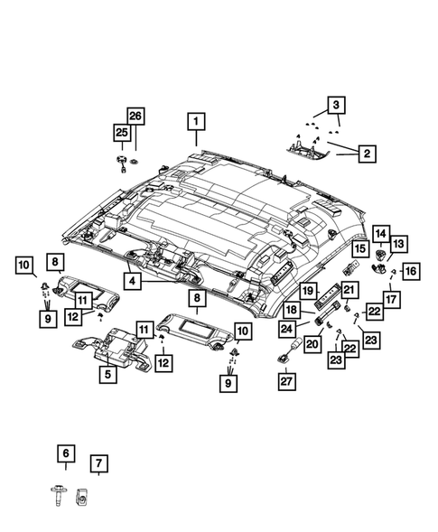
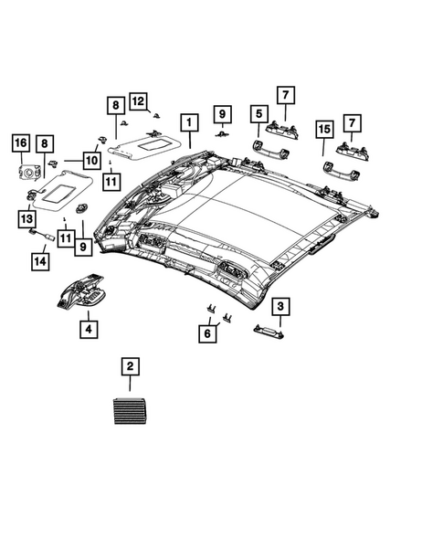
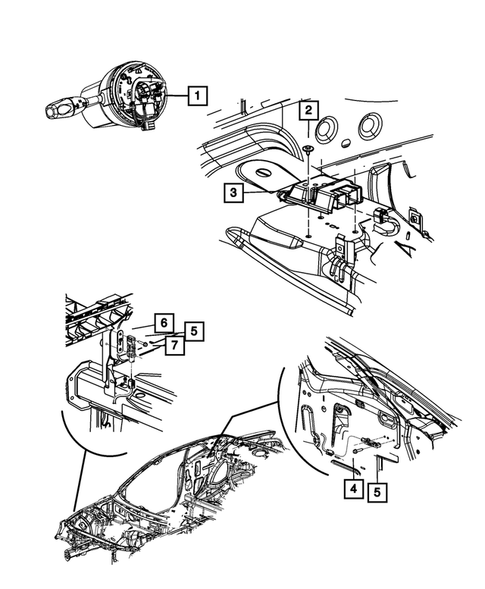
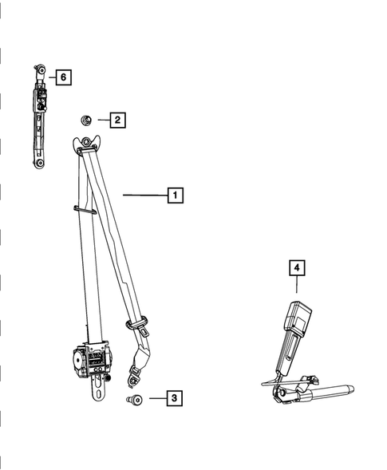
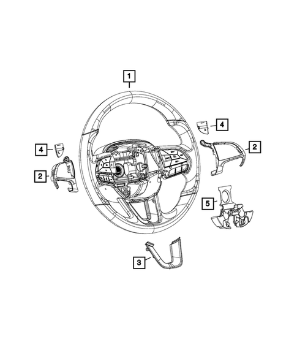
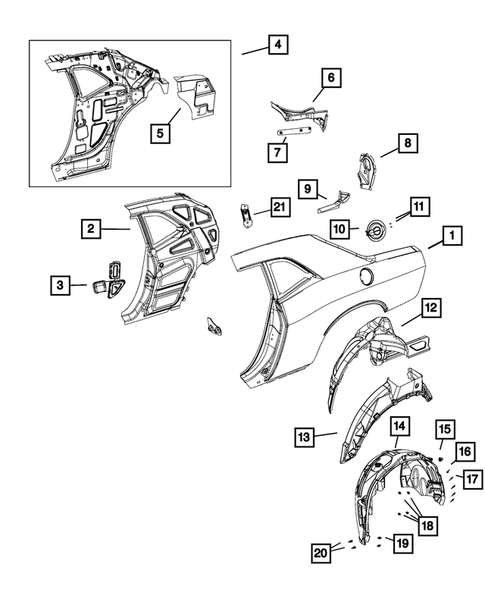
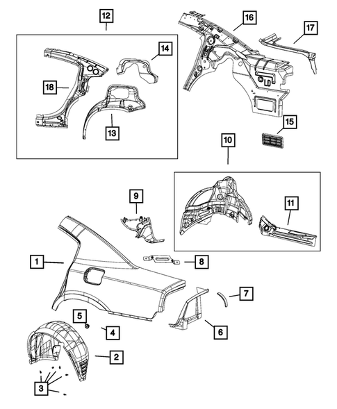
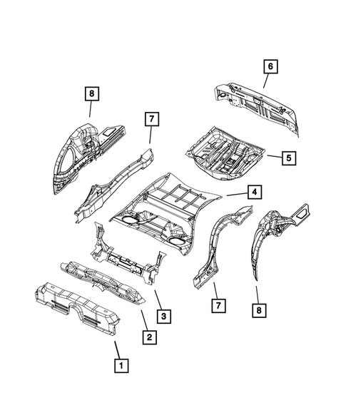
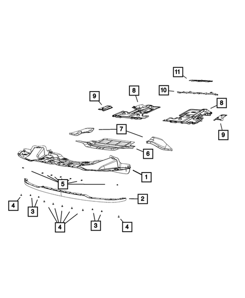

# Expanded Challenger–Charger Similarity Supplement for Previously Unresolved ADR Areas
**2017 cross-variant/trim Mopar catalog screening**
**Date:** 2026-07-31

## Executive determination
Under the broad user-defined rule—mixing Challenger and Charger variants/trims and accepting a relevant exact component match or corresponding functional architecture as a pass—**all 13 previously unresolved ADR areas pass the similarity screen**.
- **6 exact-direct passes:** ADRs 21/00, 42/04, 69/00, 72/00, 73/00, 85/00.
- **2 exact-supporting passes:** ADRs 25/02, 34/02.
- **5 functional-architecture passes:** ADRs 8/01, 11/00, 14/02, 18/03, 29/00.
- Screening basis: 7 variants, 16 categories, 112 route/category jobs attempted, 94 populated and 18 zero-row jobs; 2253 catalog rows, 93 exact category-level common part numbers and 22 representative drawings; recorded scraper errors: 0. Zero-row jobs are coverage gaps, not successful populated routes.

**Regulatory limit:** A similarity pass is not an ADR compliance pass. Catalog evidence cannot prove markings, geometry, strength, field of view, calibration, crash pulse, sensing logic, installed configuration or test performance.

## ADR result matrix
| ADR | Subject | Challenger direct candidates | Charger direct candidates | Exact direct | Exact supporting-only | Result |
|---|---|---:|---:|---:|---:|---|
| 8/01 | Safety Glazing Material | 9 | 9 | 0 | 28 | FUNCTIONAL-ARCHITECTURE PASS |
| 11/00 | Internal Sun Visors | 9 | 15 | 0 | 1 | FUNCTIONAL-ARCHITECTURE PASS |
| 14/02 | Rear Vision Mirrors | 13 | 66 | 0 | 2 | FUNCTIONAL-ARCHITECTURE PASS |
| 18/03 | Instrumentation | 22 | 27 | 0 | 13 | FUNCTIONAL-ARCHITECTURE PASS |
| 21/00 | Instrument Panel | 22 | 31 | 3 | 10 | EXACT-DIRECT PART MATCH PASS |
| 25/02 | Anti-Theft Lock | 0 | 0 | 0 | 22 | EXACT-SUPPORTING PART MATCH PASS |
| 29/00 | Side Door Strength | 20 | 21 | 0 | 33 | FUNCTIONAL-ARCHITECTURE PASS |
| 34/02 | Child Restraint Anchorages and Child Restraint Anchor Fittings | 0 | 0 | 0 | 12 | EXACT-SUPPORTING PART MATCH PASS |
| 42/04 | General Safety Requirements | 85 | 164 | 40 | 15 | EXACT-DIRECT PART MATCH PASS |
| 69/00 | Full Frontal Impact Occupant Protection | 37 | 41 | 20 | 25 | EXACT-DIRECT PART MATCH PASS |
| 72/00 | Dynamic Side Impact Occupant Protection | 17 | 17 | 4 | 39 | EXACT-DIRECT PART MATCH PASS |
| 73/00 | Offset Frontal Impact Occupant Protection | 37 | 41 | 20 | 25 | EXACT-DIRECT PART MATCH PASS |
| 85/00 | Pole Side Impact Performance | 9 | 5 | 1 | 38 | EXACT-DIRECT PART MATCH PASS |

## Controlled evidence statements
| ADR | Selected exact parts | Similarity statement | Limitation |
|---|---|---|---|
| 8/01 | [none — functional comparison] | Both models expose windscreen/door/quarter-glass catalog architecture; no exact glazing service number was established. | Similarity/catalog evidence only; does not prove ADR compliance, installed VIN configuration or test performance. |
| 11/00 | [none — functional comparison] | Both models expose visor assemblies and attachments; the sole exact category overlap is an audio microphone, not a visor. | Similarity/catalog evidence only; does not prove ADR compliance, installed VIN configuration or test performance. |
| 14/02 | [none — functional comparison] | Both models expose interior/exterior mirror systems; no exact mirror assembly or glass number was established. | Similarity/catalog evidence only; does not prove ADR compliance, installed VIN configuration or test performance. |
| 18/03 | [none — functional comparison] | Both models expose instrument-cluster and display architecture; no exact cluster service number was established. | Similarity/catalog evidence only; does not prove ADR compliance, installed VIN configuration or test performance. |
| 21/00 | 1QF13DX9AP \| 68110649AA \| 68110650AA | Exact common glove-box, dampener and latch-striker components support shared instrument-panel architecture. | Similarity/catalog evidence only; does not prove ADR compliance, installed VIN configuration or test performance. |
| 25/02 | 68404422AA | Exact common ignition-switch trim ring is supporting interface evidence only; it does not establish anti-theft lock, steering-lock or immobilizer identity. | Similarity/catalog evidence only; does not prove ADR compliance, installed VIN configuration or test performance. |
| 29/00 | 1MZ84DX8AM \| 1MZ85KBXAM | Shared front-door handles plus corresponding door/aperture categories support functional body-side architecture; no exact intrusion beam or door-strength structure was established. | Similarity/catalog evidence only; does not prove ADR compliance, installed VIN configuration or test performance. |
| 34/02 | 4628848AB \| 68110232AA \| 68110212AA \| 68110213AA \| 68110214AA | Exact common rear-seat latch/striker and seat-bracket parts support rear-seat architecture; no exact child-tether anchorage service number was identified. | Similarity/catalog evidence only; does not prove ADR compliance, installed VIN configuration or test performance. |
| 42/04 | 1MZ84DX8AM \| 1MZ85KBXAM \| 6AD80DX9AA \| 6AD81DX9AA | Exact door-handle and steering-wheel components support common general-safety control architecture. | Similarity/catalog evidence only; does not prove ADR compliance, installed VIN configuration or test performance. |
| 69/00 | 56054085AA \| 6ET081X9AB \| 6ET091X9AB \| 68140569AG \| 68259474AD \| 6AD80DX9AA | Exact acceleration sensor, front inner belts, steering columns and steering-wheel components support common frontal-restraint architecture. | Similarity/catalog evidence only; does not prove ADR compliance, installed VIN configuration or test performance. |
| 72/00 | 56054085AA \| 6ET081X9AB \| 6ET091X9AB | Exact acceleration sensor and front inner belt components support common side-impact restraint architecture. | Similarity/catalog evidence only; does not prove ADR compliance, installed VIN configuration or test performance. |
| 73/00 | 56054085AA \| 6ET081X9AB \| 6ET091X9AB \| 68140569AG \| 68259474AD | Exact sensor, belt and steering-column components support common offset-frontal restraint architecture. | Similarity/catalog evidence only; does not prove ADR compliance, installed VIN configuration or test performance. |
| 85/00 | 56054085AA | Exact acceleration-sensor commonality supports side-impact sensing architecture; applicability is probably not mandatory for these 2017 vehicles and remains conditional. | Similarity/catalog evidence only; does not prove ADR compliance, installed VIN configuration or test performance. |

## Selected exact-part descriptions
### ADR 8/01 — Safety Glazing Material
**Assessment:** FUNCTIONAL-ARCHITECTURE PASS
**Selected evidence:** [none]
**Controlled statement:** Both models expose windscreen/door/quarter-glass catalog architecture; no exact glazing service number was established.
**Official ADR:** https://www.legislation.gov.au/F2005L03908/latest/text

### ADR 11/00 — Internal Sun Visors
**Assessment:** FUNCTIONAL-ARCHITECTURE PASS
**Selected evidence:** [none]
**Controlled statement:** Both models expose visor assemblies and attachments; the sole exact category overlap is an audio microphone, not a visor.
**Official ADR:** https://www.legislation.gov.au/F2006L01785/latest/text

### ADR 14/02 — Rear Vision Mirrors
**Assessment:** FUNCTIONAL-ARCHITECTURE PASS
**Selected evidence:** [none]
**Controlled statement:** Both models expose interior/exterior mirror systems; no exact mirror assembly or glass number was established.
**Official ADR:** https://www.legislation.gov.au/F2006L02663/latest/text

### ADR 18/03 — Instrumentation
**Assessment:** FUNCTIONAL-ARCHITECTURE PASS
**Selected evidence:** [none]
**Controlled statement:** Both models expose instrument-cluster and display architecture; no exact cluster service number was established.
**Official ADR:** https://www.legislation.gov.au/F2006L01392/latest/text

### ADR 21/00 — Instrument Panel
**Assessment:** EXACT-DIRECT PART MATCH PASS
**Selected evidence:** 1QF13DX9AP — 2011 2021 Mopar Instrument Panel Glove Box | 68110649AA — Glove Box Door Dampener | 68110650AA — Glove Box Door Latch Striker
**Controlled statement:** Exact common glove-box, dampener and latch-striker components support shared instrument-panel architecture.
**Official ADR:** https://www.legislation.gov.au/F2006L01786/latest/text

### ADR 25/02 — Anti-Theft Lock
**Assessment:** EXACT-SUPPORTING PART MATCH PASS
**Selected evidence:** 68404422AA — Ignition Switch Trim Ring
**Controlled statement:** Exact common ignition-switch trim ring is supporting interface evidence only; it does not establish anti-theft lock, steering-lock or immobilizer identity.
**Official ADR:** https://www.legislation.gov.au/F2006L02664/latest/text

### ADR 29/00 — Side Door Strength
**Assessment:** FUNCTIONAL-ARCHITECTURE PASS
**Selected evidence:** 1MZ84DX8AM — 2013 2021 Mopar Front Door Exterior Handle Right | 1MZ85KBXAM — 2013 2018 Mopar Front Door Exterior Handle Left
**Controlled statement:** Shared front-door handles plus corresponding door/aperture categories support functional body-side architecture; no exact intrusion beam or door-strength structure was established.
**Official ADR:** https://www.legislation.gov.au/F2006L01429/latest/text

### ADR 34/02 — Child Restraint Anchorages and Child Restraint Anchor Fittings
**Assessment:** EXACT-SUPPORTING PART MATCH PASS
**Selected evidence:** 4628848AB — Seat Back Latch Striker | 68110232AA — Seat Latch | 68110212AA — Seat Bracket | 68110213AA — Seat Bracket | 68110214AA — Seat Bracket
**Controlled statement:** Exact common rear-seat latch/striker and seat-bracket parts support rear-seat architecture; no exact child-tether anchorage service number was identified.
**Official ADR:** https://www.legislation.gov.au/F2012L00703/latest/text

### ADR 42/04 — General Safety Requirements
**Assessment:** EXACT-DIRECT PART MATCH PASS
**Selected evidence:** 1MZ84DX8AM — 2013 2021 Mopar Front Door Exterior Handle Right | 1MZ85KBXAM — 2013 2018 Mopar Front Door Exterior Handle Left | 6AD80DX9AA — Steering Wheel | 6AD81DX9AA — Steering Wheel
**Controlled statement:** Exact door-handle and steering-wheel components support common general-safety control architecture.
**Official ADR:** https://www.legislation.gov.au/F2005L03996/latest/text

### ADR 69/00 — Full Frontal Impact Occupant Protection
**Assessment:** EXACT-DIRECT PART MATCH PASS
**Selected evidence:** 56054085AA — Acceleration Sensor | 6ET081X9AB — Front Inner Seat Belt Right | 6ET091X9AB — Front Inner Seat Belt Left | 68140569AG — 2014 2021 Mopar Steering Column | 68259474AD — 2014 2021 Mopar Steering Column | 6AD80DX9AA — Steering Wheel
**Controlled statement:** Exact acceleration sensor, front inner belts, steering columns and steering-wheel components support common frontal-restraint architecture.
**Official ADR:** https://www.legislation.gov.au/F2006L01455/latest/text

### ADR 72/00 — Dynamic Side Impact Occupant Protection
**Assessment:** EXACT-DIRECT PART MATCH PASS
**Selected evidence:** 56054085AA — Acceleration Sensor | 6ET081X9AB — Front Inner Seat Belt Right | 6ET091X9AB — Front Inner Seat Belt Left
**Controlled statement:** Exact acceleration sensor and front inner belt components support common side-impact restraint architecture.
**Official ADR:** https://www.legislation.gov.au/F2005L03992/latest/text

### ADR 73/00 — Offset Frontal Impact Occupant Protection
**Assessment:** EXACT-DIRECT PART MATCH PASS
**Selected evidence:** 56054085AA — Acceleration Sensor | 6ET081X9AB — Front Inner Seat Belt Right | 6ET091X9AB — Front Inner Seat Belt Left | 68140569AG — 2014 2021 Mopar Steering Column | 68259474AD — 2014 2021 Mopar Steering Column
**Controlled statement:** Exact sensor, belt and steering-column components support common offset-frontal restraint architecture.
**Official ADR:** https://www.legislation.gov.au/F2005L03990/latest/text

### ADR 85/00 — Pole Side Impact Performance
**Assessment:** EXACT-DIRECT PART MATCH PASS
**Selected evidence:** 56054085AA — Acceleration Sensor
**Controlled statement:** Exact acceleration-sensor commonality supports side-impact sensing architecture; applicability is probably not mandatory for these 2017 vehicles and remains conditional.
**Official ADR:** https://www.legislation.gov.au/F2015L02109/latest/text

## Representative exploded drawings
### Challenger — headliners-visors catalog assembly 1: Headliner, Export
Source: https://www.moparamerica.com/v-2017-dodge-challenger--r-t-scat-pack--6-4l-v8-gas/interior-trim--headliners-visors-assist-straps?assembly=1

### Charger — headliners-visors catalog assembly 1: Headliner
Source: https://www.moparamerica.com/v-2017-dodge-charger--r-t-scat-pack--6-4l-v8-gas/interior-trim--headliners-visors-assist-straps?assembly=1

### Challenger — front-door catalog assembly 1: Door Handle Bracket, Right
Source: https://www.moparamerica.com/v-2017-dodge-challenger--r-t-scat-pack--6-4l-v8-gas/doors-door-mirrors-and-related-parts--front-door?assembly=1

### Charger — front-door catalog assembly 1: Round Black Tape
Source: https://www.moparamerica.com/v-2017-dodge-charger--r-t-scat-pack--6-4l-v8-gas/doors-door-mirrors-and-related-parts--front-door?assembly=1

### Challenger — air-bags catalog assembly 1: Steering Column Module
Source: https://www.moparamerica.com/v-2017-dodge-challenger--r-t-scat-pack--6-4l-v8-gas/restraints--air-bags?assembly=1

### Challenger — seat-belts catalog assembly 1: Seat Belt Extender
Source: https://www.moparamerica.com/v-2017-dodge-challenger--r-t-scat-pack--6-4l-v8-gas/restraints--seat-belts?assembly=1

### Challenger — steering-wheel catalog assembly 1: Oval Head Screw
Source: https://www.moparamerica.com/v-2017-dodge-challenger--r-t-scat-pack--6-4l-v8-gas/steering--steering-wheel?assembly=1

### Challenger — aperture-pillars catalog assembly 1: Body Side Aperture Rear Panel, Right
Source: https://www.moparamerica.com/v-2017-dodge-challenger--r-t-scat-pack--6-4l-v8-gas/body-sheet-metal-except-doors--aperture-panel-and-pillar-supports?assembly=1

### Charger — aperture-pillars catalog assembly 1: Body Side Aperture Outer Panel, Left
Source: https://www.moparamerica.com/v-2017-dodge-charger--r-t-scat-pack--6-4l-v8-gas/body-sheet-metal-except-doors--aperture-panel-and-pillar-supports?assembly=1

### Challenger — floor-pans catalog assembly 1: Seat Belt Anchor Reinforcement
Source: https://www.moparamerica.com/v-2017-dodge-challenger--r-t-scat-pack--6-4l-v8-gas/body-sheet-metal-except-doors--floor-pans?assembly=1

### Charger — floor-pans catalog assembly 1: Hex Head Screw And Washer
Source: https://www.moparamerica.com/v-2017-dodge-charger--r-t-scat-pack--6-4l-v8-gas/body-sheet-metal-except-doors--floor-pans?assembly=1

## Evidence needed to convert similarity into compliance evidence
1. VIN/variant-specific build and fitted-component records.
2. Manufacturer drawings, specifications and controlled declarations.
3. Applicable ADR/UN/FMVSS test reports with demonstrated variant coverage.
4. Physical labels, markings, dimensions and inspection evidence where the ADR requires them.
5. Clause-level comparison for each accepted alternative-standard route and confirmation that the route is legally available.