# 2017 Dodge Charger / Chrysler 300 — ADR-Critical Interior Hardware Catalog Commonality
**VINs 2C3CDXGJ2HH530684 and 2C3CCAEG4HH586472**
**Date:** 2026-07-31
**Status:** CONDITIONAL — strong catalog-level commonality; installed configuration and ADR compliance are not proven

## Executive determination
- **VERIFIED:** 45 MoparAmerica exploded-diagram records were collected with local images and source URLs.
- **VERIFIED:** 1435 raw catalog-part rows were parsed and reduced to 606 deduplicated VIN/category candidates.
- **VERIFIED:** 86 candidate part numbers occur in both vehicle catalog routes; 63 are selected as ADR-critical by component keyword/scope.
- **VERIFIED:** The supplied 2023 LD STARPARTS sample contains 15 callout items and 19 unique part numbers. 14 of the 19 occur in both selected 2017 catalog routes; 2 occur only in the Charger route; 3 occur in neither 2017 route.
- **CONDITIONAL:** This is meaningful catalog commonality evidence, especially for seat tracks/adjusters, seat frames/brackets/fasteners, belt hardware, airbag-related hardware and steering components.
- **GAP:** Catalog presence does not establish which option-dependent part is actually installed on either VIN. The Chrysler VIN did not resolve in MoparAmerica and was routed by decoded model/trim.
- **GAP:** The forwarding email text says “this is a challenger” while the STARPARTS title identifies platform LD; this provenance inconsistency prevents vehicle-specific reliance.
- **GAP:** Parts-catalog commonality cannot by itself prove ADR performance, crashworthiness, calibration or legal compliance.

## Vehicle identity and catalog routing
| VIN | Vehicle | Catalog status |
|---|---|---|
| 2C3CDXGJ2HH530684 | 2017 Dodge Charger R/T 392 / MoparAmerica R/T Scat Pack 6.4L V8 Gas | VIN search accepted |
| 2C3CCAEG4HH586472 | 2017 Chrysler 300C 3.6L V6 RWD / MoparAmerica C 3.6L V6 Flex | VIN search failed; route inferred from decoded identity |

## Supplied STARPARTS sample
The supplied PDF is a 2023 LD passenger power-seat adjuster/recliner/shield/riser extract. It is later-model contextual evidence, not VIN-specific 2017 proof.

| Callout | Description | Part numbers |
|---:|---|---|
| 1 | PANEL, Front Seat Back | 1UY02DX9AC |
| 2 | FRAME, Front Seat Back | 68159139AA | 68593541AA | 68593544AA |
| 3 | ADJUSTER, Power Seat | 68193460AC | 68193462AC |
| 4 | COVER, Track, Rear | 1UV50DX9AA |
| 5 | COVER, Track, Front | 1UV51DX9AA |
| 6 | SCREW, Hex Head, M14x1.5x109.0, Adjuster To Floor | 06507594AA |
| 7 | BRACKET, Seat, Side Shield Attaching | 68157098AA |
| 8 | SHIELD, Seat Adjuster | 1UZ62DX9AC |
| 9 | COVER, Front Seat Anchor Bolt | 1UV75DX9AA | 1UV75DX9AB |
| 10 | CHUTE, Airbag | 68102980AA | 68103691AA |
| -11 | BLOWER, Seat Back | 55057389AD |
| -12 | BLOWER, Seat Cushion | 68306763AA |
| -13 | BRACKET, Module, Heated Seat Module, (NOT SERVICED) | [not serviced] |
| -14 | BOLT, Seat, Seat Back to Cushion | 68104960AA |
| -15 | NUT, M6x1.00, Air Bag Attaching | 68104961AA |

## 2023 sample cross-check against 2017 catalog routes
| 2023 part | Description | Charger | Chrysler 300 |
|---|---|:---:|:---:|
| 1UY02DX9AC | PANEL, Front Seat Back | YES | YES |
| 68159139AA | FRAME, Front Seat Back | YES | YES |
| 68593541AA | FRAME, Front Seat Back | NO | NO |
| 68593544AA | FRAME, Front Seat Back | NO | NO |
| 68193460AC | ADJUSTER, Power Seat | YES | YES |
| 68193462AC | ADJUSTER, Power Seat | YES | YES |
| 1UV50DX9AA | COVER, Track, Rear | YES | YES |
| 1UV51DX9AA | COVER, Track, Front | YES | YES |
| 06507594AA | SCREW, Hex Head, M14x1.5x109.0, Adjuster To Floor | YES | YES |
| 68157098AA | BRACKET, Seat, Side Shield Attaching | YES | YES |
| 1UZ62DX9AC | SHIELD, Seat Adjuster | YES | YES |
| 1UV75DX9AA | COVER, Front Seat Anchor Bolt | NO | NO |
| 1UV75DX9AB | COVER, Front Seat Anchor Bolt | YES | YES |
| 68102980AA | CHUTE, Airbag | YES | YES |
| 68103691AA | CHUTE, Airbag | YES | YES |
| 55057389AD | BLOWER, Seat Back | YES | YES |
| 68306763AA | BLOWER, Seat Cushion | YES | YES |
| 68104960AA | BOLT, Seat, Seat Back to Cushion | YES | NO |
| 68104961AA | NUT, M6x1.00, Air Bag Attaching | YES | NO |

## Category overlap
| Category | Charger candidates | Chrysler candidates | Common | Jaccard |
|---|---:|---:|---:|---:|
| air-bags | 12 | 27 | 9 | 0.3 |
| front-seat-adjusters | 36 | 37 | 28 | 0.6222 |
| front-seats-first-row | 0 | 86 | 0 | 0.0 |
| instrument-panel | 54 | 71 | 14 | 0.1261 |
| rear-seat-adjusters | 21 | 0 | 0 | 0.0 |
| rear-seats-second-row | 85 | 88 | 15 | 0.0949 |
| seat-belts | 17 | 21 | 10 | 0.3571 |
| steering-column | 10 | 12 | 7 | 0.4667 |
| steering-wheel | 13 | 16 | 3 | 0.1154 |

## ADR scope matrix
Exact legal applicability is conditional on the relevant first-manufacture/new-model date and approval pathway.
| ADR | Title | Tier | Catalog-evidence role | Status |
|---|---|---|---|---|
| 2/01 | Side Door Latches and Hinges | ancillary interior/body closure | Catalog commonality could identify shared service parts, but cannot prove door-retention performance. | LIKELY; confirm approval-pathway applicability. |
| 3/03 | Seats and Seat Anchorages | core | Identical OEM service part numbers can support shared seat hardware/configuration; not strength/test proof. | LIKELY BUILD-APPLICABLE; exact model/first-manufacture basis TBC. |
| 4/05 | Seatbelts | core | Part-number overlap supports common components; variant/colour/side qualifiers must match. | LIKELY BUILD-APPLICABLE. |
| 5/05 | Anchorages for Seatbelts | core | Catalog data may identify common attaching hardware; structural anchorage performance remains unproven. | LIKELY BUILD-APPLICABLE. |
| 8/01 | Safety Glazing Material | ancillary interior | Parts catalog is secondary; physical marking/approval evidence is required. | LIKELY; outside present hardware comparison. |
| 10/02 | Steering Column | conditional core | Commonity may be assessed, but ADR 10 performance/exemption is not proven by catalog matching. | CONDITIONAL: ADR 10/02 clause 6.2 exemption may apply if ADR 69 compliance using a steering-column airbag is established. |
| 11/00 | Internal Sun Visors | ancillary interior | Service-part matching is supportive only; geometry/energy requirements require inspection/specification. | LIKELY; outside present core packet. |
| 14/02 | Rear Vision Mirrors | ancillary interior | Part commonality does not prove fields of view. | LIKELY; outside present core packet. |
| 18/03 | Instrumentation | ancillary interior | Part matching cannot prove symbol, visibility or calibration compliance. | LIKELY BUILD-APPLICABLE. |
| 21/00 | Instrument Panel | core interior | Shared parts support common interior architecture but not energy-absorption or control performance. | LIKELY BUILD-APPLICABLE. |
| 22/00 | Head Restraints | core | Part-number overlap is relevant to geometry/locking commonality, subject to installed-position verification. | LIKELY BUILD-APPLICABLE. |
| 34/02 | Child Restraint Anchorages and Child Restraint Anchor Fittings | core | Catalog matching can identify common anchors/brackets; location and strength require controlled evidence. | LIKELY 2017 BUILD-APPLICABLE EDITION; ADR 34/03 was made later in 2017. |
| 69/00 | Full Frontal Impact Occupant Protection | system-level | Catalog commonality alone cannot establish crash-performance equivalence or calibration. | LIKELY BUILD-APPLICABLE. |
| 72/00 | Dynamic Side Impact Occupant Protection | system-level | Shared part numbers support architecture commonality only; crash structure/calibration remains outside catalog proof. | LIKELY BUILD-APPLICABLE. |
| 73/00 | Offset Frontal Impact Occupant Protection | system-level | Catalog commonality is insufficient for offset crashworthiness. | POTENTIALLY BUILD-APPLICABLE; exact category/date/approval-pathway applicability requires confirmation. |

## Common ADR-critical catalog candidates
| Category | Part number | Charger description | Chrysler 300 description |
|---|---|---|---|
| air-bags | 5LB70DX9AH | Module | Steering Column Module | Module | Steering Column Module |
| air-bags | 5LB71DX9AI | Module | Steering Column Module | Module | Steering Column Module |
| air-bags | 5LB72DX9AH | Module | Steering Column Module | Module | Steering Column Module |
| air-bags | 6102132AA | Hex Head Screw | Screw | Hex Head Screw | Screw |
| air-bags | 6104725AA | Hex Nut | Washer | Hex Nut | Washer |
| air-bags | 6510026AA | Screw | Screw |
| front-seat-adjusters | 1UV50DX9AA | Cover | Track Cover | Rear | Track Cover |
| front-seat-adjusters | 1UV51DX9AA | Cover | Track Cover | Front | Track Cover |
| front-seat-adjusters | 1UV72DX9AA | Handle | Recliner Handle | Handle | Recliner Handle |
| front-seat-adjusters | 1UV75DX9AB | Cover | Front Seat Anchor Bolt Cover | Cover | Front Seat Anchor Bolt Cover |
| front-seat-adjusters | 1UW25DX9AB | Cover | Front Seat Anchor Bolt Cover, Left | Cover | Front Seat Anchor Bolt Cover, Left |
| front-seat-adjusters | 1UY02DX9AC | 2011-2021 Mopar Front Seat Back Panel | Panel | 2011-2021 Mopar Front Seat Back Panel | Panel |
| front-seat-adjusters | 1UY08DX9AB | Seat Shield | Shield | Seat Shield | Shield |
| front-seat-adjusters | 1UY33DX9AC | 2011-2020 Mopar Seat Adjuster Shield | Shield | 2011-2020 Mopar Seat Adjuster Shield | Shield |
| front-seat-adjusters | 1UZ62DX9AC | 2011-2021 Mopar Seat Adjuster Shield | Shield | 2011-2021 Mopar Seat Adjuster Shield | Shield |
| front-seat-adjusters | 55057389AD | Blower | Seat Back Blower | Blower | Seat Back Blower |
| front-seat-adjusters | 6507594AA | Hex Head Screw | Screw | Hex Head Screw |
| front-seat-adjusters | 68102980AA | Airbag Chute | Chute | Airbag Chute |
| front-seat-adjusters | 68103691AA | Airbag Chute | Chute | Airbag Chute |
| front-seat-adjusters | 68103696AA | Frame | Front Seat Back Frame | Frame | Front Seat Back Frame |
| front-seat-adjusters | 68104427AA | Frame | Front Seat Back Frame | Frame | Front Seat Back Frame |
| front-seat-adjusters | 68104489AA | Frame | Front Seat Back Frame | Frame | Front Seat Back Frame |
| front-seat-adjusters | 68157098AA | Bracket | Seat Bracket | Bracket | Seat Bracket |
| front-seat-adjusters | 68157292AA | Front | Seat Bracket | Bracket | Seat Bracket |
| front-seat-adjusters | 68157294AA | Rear | Seat Bracket | Bracket | Seat Bracket |
| front-seat-adjusters | 68159137AA | Frame | Front Seat Back Frame | Frame | Front Seat Back Frame |
| front-seat-adjusters | 68159139AA | Frame | Front Seat Back Frame | Frame | Front Seat Back Frame |
| front-seat-adjusters | 68159141AA | Bracket | Seat Bracket | Bracket | Seat Bracket |
| front-seat-adjusters | 68193458AC | 2013-2021 Mopar Manual Seat Adjuster | Adjuster | 2013-2021 Mopar Manual Seat Adjuster | Adjuster |
| front-seat-adjusters | 68193460AC | Adjuster | Power Seat Adjuster | Adjuster | Power Seat Adjuster |
| front-seat-adjusters | 68193462AC | 2013-2020 Mopar Power Seat Adjuster | Adjuster | 2013-2020 Mopar Power Seat Adjuster | Adjuster |
| front-seat-adjusters | 68264615AB | Adjuster | Power Seat Adjuster | Adjuster | Power Seat Adjuster |
| front-seat-adjusters | 68264619AB | 2015-2021 Mopar Power Seat Adjuster | Adjuster | 2015-2021 Mopar Power Seat Adjuster | Adjuster |
| front-seat-adjusters | 68306763AA | Blower | Seat Cushion Blower | Blower | Seat Cushion Blower |
| instrument-panel | 1JN63DX9AF | 2011-2021 Mopar Steering Column Opening Kneeblocker | Kneeblocker | 2011-2021 Mopar Steering Column Opening Kneeblocker | Kneeblocker |
| rear-seats-second-row | 1DL16DX9AA | Headrest Sleeve, Locking | Locking | Headrest Sleeve, Locking | Locking |
| rear-seats-second-row | 1UY04DX9AB | Headrest Sleeve, Non-Locking | Non-locking | Headrest Sleeve, Non-Locking | Non-locking |
| rear-seats-second-row | 5SB021V5AB | Seat Bolster, Right | Right | Seat Bolster, Right |
| rear-seats-second-row | 5SB031V5AB | Seat Bolster, Left | Left | Seat Bolster, Left |
| rear-seats-second-row | 5SB041X9AB | Seat Bolster, Right | Right | Seat Bolster, Right |
| rear-seats-second-row | 5SB051X9AB | Seat Bolster, Left | Left | Seat Bolster, Left |
| rear-seats-second-row | 5YA39DX9AA | Headrest | Rear Headrest | Headrest | Rear Headrest |
| rear-seats-second-row | 68102973AA | Foam | Seat Back Foam | Foam | Seat Back Foam |
| rear-seats-second-row | 68104310AA | Foam | Seat Back Foam | Foam | Seat Back Foam |
| rear-seats-second-row | 68159129AA | Frame | Rear Seat Cushion Frame | Frame | Rear Seat Cushion Frame |
| rear-seats-second-row | 68159140AA | Foam | Seat Cushion Foam | Foam | Seat Cushion Foam |
| seat-belts | 1HZ06DX9AI | Front Outer Seat Belt, Right | Right | Front Outer Seat Belt, Right | Right |
| seat-belts | 5135197AA | Seat Belt Extender | Seat Belt Extender |
| seat-belts | 6105124AA | Pan Head Screw | Pan Head Screw |
| seat-belts | 6502724 | Hex Flange Nut | Nut | Hex Flange Nut | Nut |
| seat-belts | 6504537 | Flange Locking Nut | Nut | Flange Locking Nut | Nut |
| seat-belts | 6509460AA | Hex Nut | Nut | Hex Nut | Nut |
| seat-belts | 68080745AD | Adjuster | Seat Belt Turning Loop Adjuster | Adjuster | Seat Belt Turning Loop Adjuster |
| seat-belts | 68770846AA | Buckle Assembly-S/Belt Buckle Assembly | Right | Assy | Buckle Assembly-S/Belt Buckle Assembly |
| seat-belts | 6ET091X9AB | Front Inner Seat Belt, Left | Left | Front Inner Seat Belt, Left | Left |
| steering-column | 6104406AA | Hex Head Screw And Washer | Washer | Hex Head Screw And Washer | Washer |
| steering-column | 6104709AA | Hex Flange Nut | Nut | Hex Flange Nut | Nut |
| steering-column | 6104716AA | Hex Flange Nut | Nut | Hex Flange Nut | Nut |
| steering-column | 6506950AA | Bolt | Hex Flange Head Locking Bolt | Bolt | Hex Flange Head Locking Bolt |
| steering-column | 6510755AA | Hex Head Screw And Washer | Washer | Hex Head Screw And Washer | Washer |
| steering-column | 68140569AG | 2014-2021 Mopar Steering Column | Column | 2014-2021 Mopar Steering Column | Column |
| steering-column | 68259474AD | 2014-2021 Mopar Steering Column | Column | 2014-2021 Mopar Steering Column | Column |
| steering-wheel | 6511907AA | Oval Head Screw | Screw | Oval Head Screw | Screw |

## Illustration register
### 2C3CDXGJ2HH530684 — front-seat-adjusters — diagram 1: Seat Bolt
Source: https://www.moparamerica.com/v-2017-dodge-charger--r-t-scat-pack--6-4l-v8-gas/interior-trim--front-seats-adjusters-recliners-shields-and-risers?assembly=1
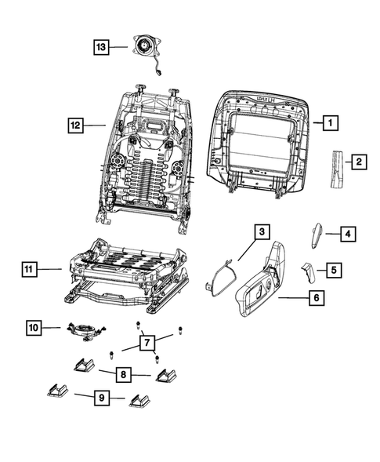

### 2C3CDXGJ2HH530684 — front-seat-adjusters — diagram 2: Seat Back Blower
Source: https://www.moparamerica.com/v-2017-dodge-charger--r-t-scat-pack--6-4l-v8-gas/interior-trim--front-seats-adjusters-recliners-shields-and-risers?assembly=2
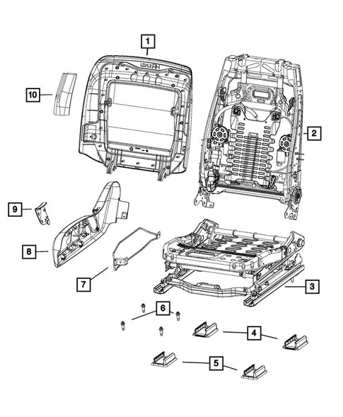

### 2C3CDXGJ2HH530684 — front-seat-adjusters — diagram 3: Seat Bolt
Source: https://www.moparamerica.com/v-2017-dodge-charger--r-t-scat-pack--6-4l-v8-gas/interior-trim--front-seats-adjusters-recliners-shields-and-risers?assembly=3
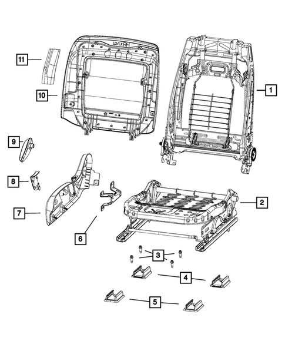

### 2C3CDXGJ2HH530684 — rear-seats-second-row — diagram 1: Assist Strap
Source: https://www.moparamerica.com/v-2017-dodge-charger--r-t-scat-pack--6-4l-v8-gas/interior-trim--rear-seats-second-row?assembly=1
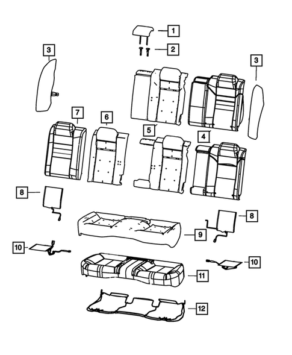

### 2C3CDXGJ2HH530684 — rear-seats-second-row — diagram 2: Armrest Lid Hinge Pin
Source: https://www.moparamerica.com/v-2017-dodge-charger--r-t-scat-pack--6-4l-v8-gas/interior-trim--rear-seats-second-row?assembly=2
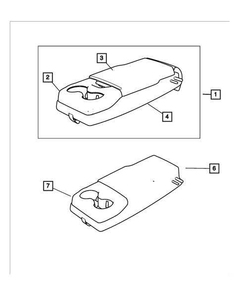

### 2C3CDXGJ2HH530684 — rear-seats-second-row — diagram 3: Rear Seat Back Frame
Source: https://www.moparamerica.com/v-2017-dodge-charger--r-t-scat-pack--6-4l-v8-gas/interior-trim--rear-seats-second-row?assembly=3
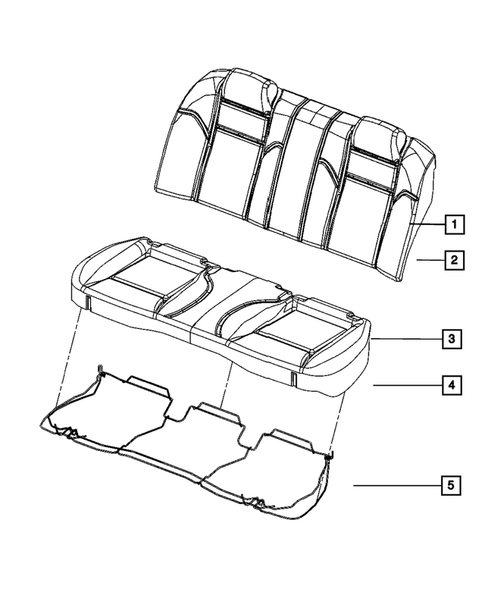

### 2C3CDXGJ2HH530684 — rear-seat-adjusters — diagram 1: Bushing 21
Source: https://www.moparamerica.com/v-2017-dodge-charger--r-t-scat-pack--6-4l-v8-gas/interior-trim--rear-seats-second-row-adjusters-recliners-shields-and-risers
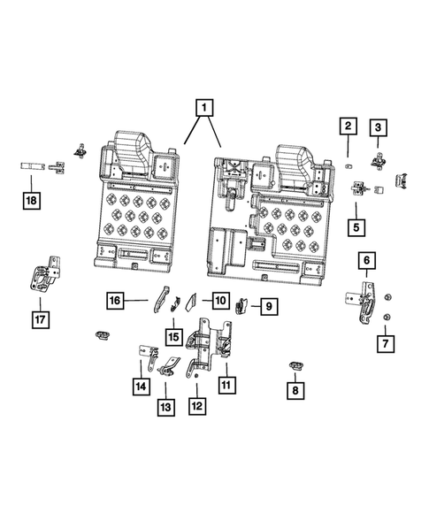

### 2C3CDXGJ2HH530684 — seat-belts — diagram 1: Seat Belt Extender
Source: https://www.moparamerica.com/v-2017-dodge-charger--r-t-scat-pack--6-4l-v8-gas/restraints--seat-belts?assembly=1
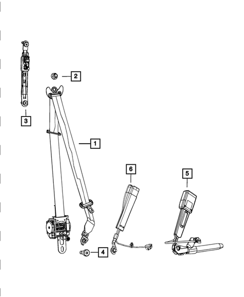

### 2C3CDXGJ2HH530684 — seat-belts — diagram 2: Retractor Seat Belt, Left
Source: https://www.moparamerica.com/v-2017-dodge-charger--r-t-scat-pack--6-4l-v8-gas/restraints--seat-belts?assembly=2
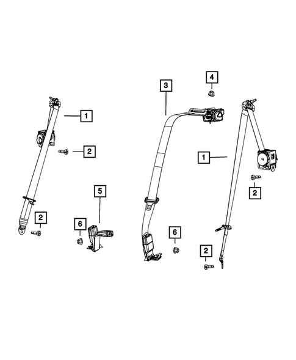

### 2C3CDXGJ2HH530684 — air-bags — diagram 1: Screw
Source: https://www.moparamerica.com/v-2017-dodge-charger--r-t-scat-pack--6-4l-v8-gas/restraints--air-bags?assembly=1
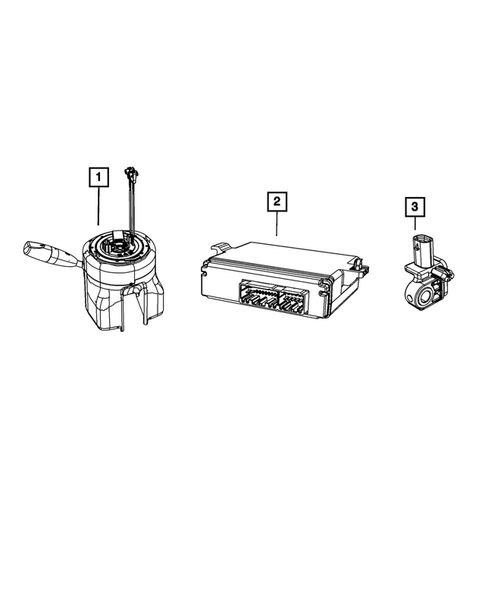

### 2C3CDXGJ2HH530684 — air-bags — diagram 2: Side Curtain Air Bag, Right
Source: https://www.moparamerica.com/v-2017-dodge-charger--r-t-scat-pack--6-4l-v8-gas/restraints--air-bags?assembly=2
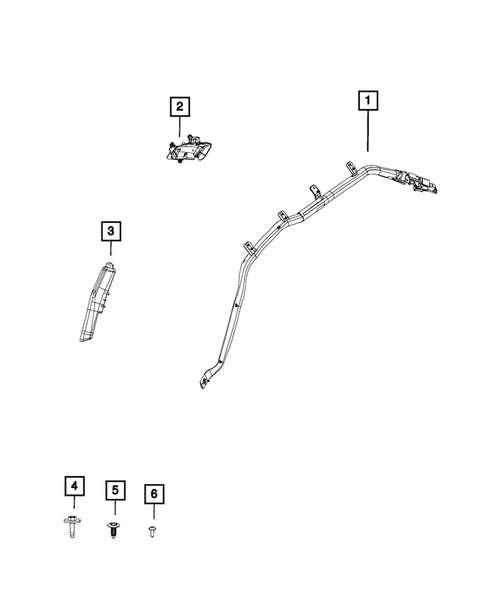

### 2C3CDXGJ2HH530684 — air-bags — diagram 3: Passenger Air Bag
Source: https://www.moparamerica.com/v-2017-dodge-charger--r-t-scat-pack--6-4l-v8-gas/restraints--air-bags?assembly=3
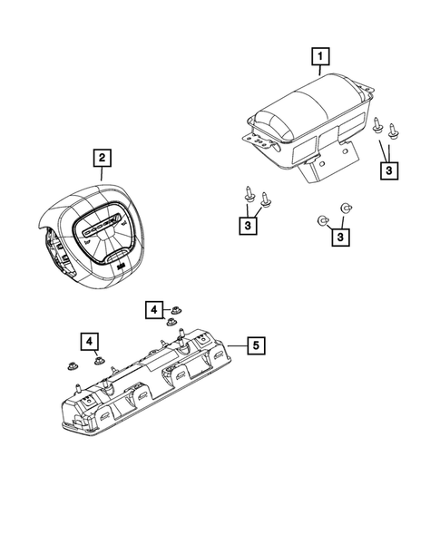

### 2C3CDXGJ2HH530684 — steering-column — diagram 1: Steering Column 14
Source: https://www.moparamerica.com/v-2017-dodge-charger--r-t-scat-pack--6-4l-v8-gas/steering--steering-column-and-intermediate-shaft
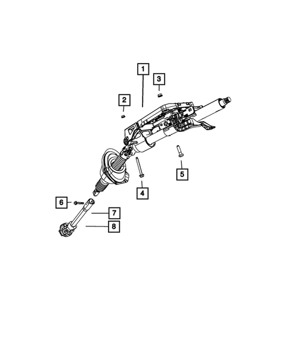

### 2C3CDXGJ2HH530684 — steering-wheel — diagram 1: Steering Wheel
Source: https://www.moparamerica.com/v-2017-dodge-charger--r-t-scat-pack--6-4l-v8-gas/steering--steering-wheel?assembly=1
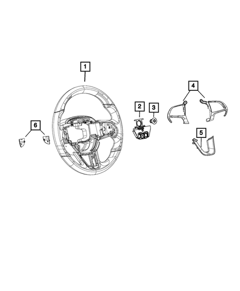

### 2C3CDXGJ2HH530684 — steering-wheel — diagram 2: Steering Wheel
Source: https://www.moparamerica.com/v-2017-dodge-charger--r-t-scat-pack--6-4l-v8-gas/steering--steering-wheel?assembly=2
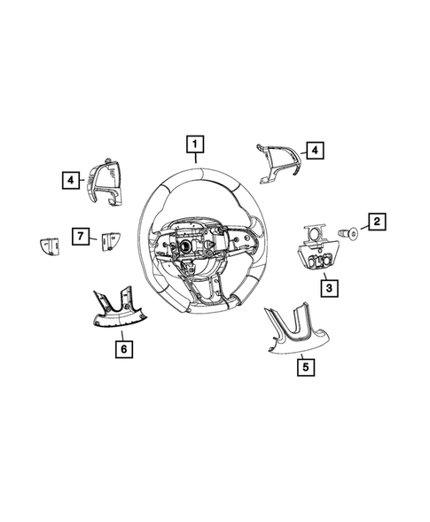

### 2C3CDXGJ2HH530684 — instrument-panel — diagram 1: Screw 76
Source: https://www.moparamerica.com/v-2017-dodge-charger--r-t-scat-pack--6-4l-v8-gas/interior-trim--instrument-panel
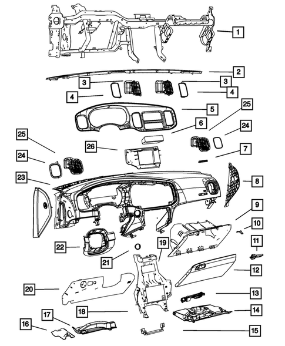

### 2C3CCAEG4HH586472 — front-seat-adjusters — diagram 1: Hex Head Screw
Source: https://www.moparamerica.com/v-2017-chrysler-300--c--3-6l-v6-flex/interior-trim--front-seats-adjusters-recliners-shields-and-risers?assembly=1
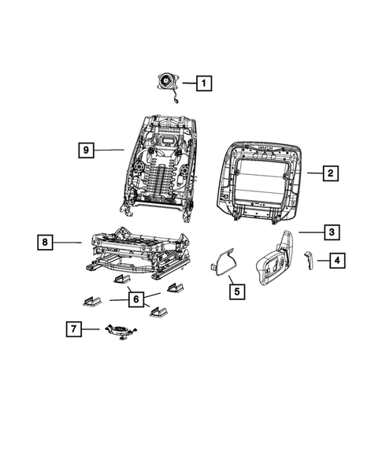

### 2C3CCAEG4HH586472 — front-seat-adjusters — diagram 2: Hex Head Screw
Source: https://www.moparamerica.com/v-2017-chrysler-300--c--3-6l-v6-flex/interior-trim--front-seats-adjusters-recliners-shields-and-risers?assembly=2
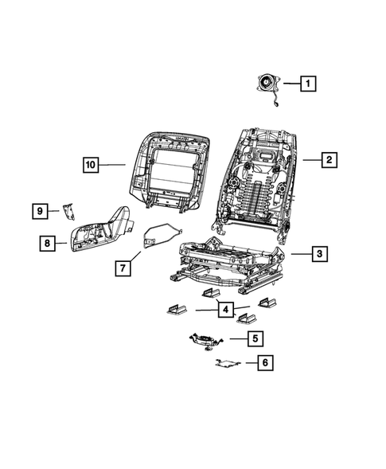

### 2C3CCAEG4HH586472 — front-seat-adjusters — diagram 3: Hex Head Screw
Source: https://www.moparamerica.com/v-2017-chrysler-300--c--3-6l-v6-flex/interior-trim--front-seats-adjusters-recliners-shields-and-risers?assembly=3
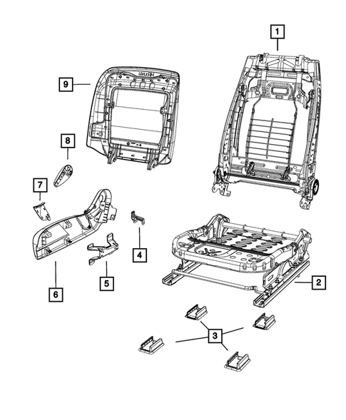

### 2C3CCAEG4HH586472 — front-seats-first-row — diagram 1: Front Headrest, Right Or Left
Source: https://www.moparamerica.com/v-2017-chrysler-300--c--3-6l-v6-flex/interior-trim--front-seats-first-row?assembly=1
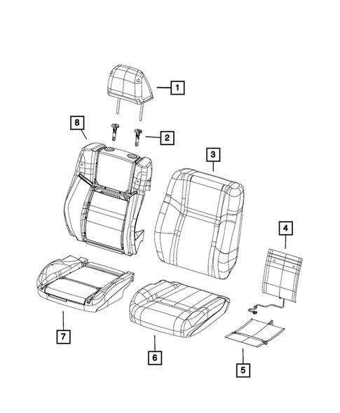

### 2C3CCAEG4HH586472 — front-seats-first-row — diagram 2: Front Headrest, Right Or Left
Source: https://www.moparamerica.com/v-2017-chrysler-300--c--3-6l-v6-flex/interior-trim--front-seats-first-row?assembly=2

### 2C3CCAEG4HH586472 — front-seats-first-row — diagram 3: Front Headrest, Right Or Left
Source: https://www.moparamerica.com/v-2017-chrysler-300--c--3-6l-v6-flex/interior-trim--front-seats-first-row?assembly=3
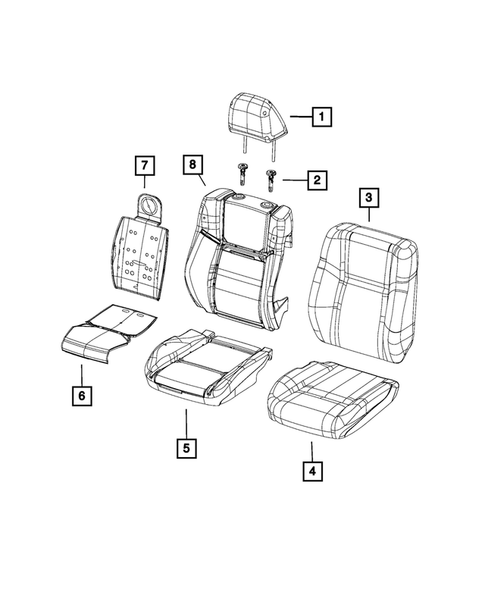

### 2C3CCAEG4HH586472 — front-seats-first-row — diagram 4: Front Headrest, Right Or Left
Source: https://www.moparamerica.com/v-2017-chrysler-300--c--3-6l-v6-flex/interior-trim--front-seats-first-row?assembly=4

### 2C3CCAEG4HH586472 — front-seats-first-row — diagram 5: Front Headrest, Right Or Left
Source: https://www.moparamerica.com/v-2017-chrysler-300--c--3-6l-v6-flex/interior-trim--front-seats-first-row?assembly=5

### 2C3CCAEG4HH586472 — front-seats-first-row — diagram 6: Front Headrest, Right Or Left
Source: https://www.moparamerica.com/v-2017-chrysler-300--c--3-6l-v6-flex/interior-trim--front-seats-first-row?assembly=6

### 2C3CCAEG4HH586472 — front-seats-first-row — diagram 7: Front Headrest, Right Or Left
Source: https://www.moparamerica.com/v-2017-chrysler-300--c--3-6l-v6-flex/interior-trim--front-seats-first-row?assembly=7
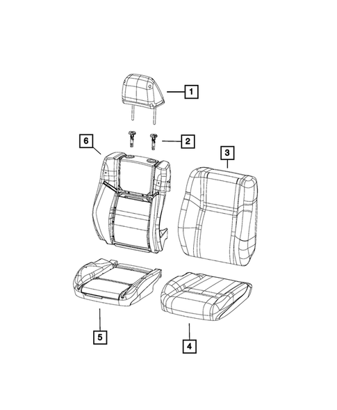

### 2C3CCAEG4HH586472 — rear-seats-second-row — diagram 1: Armrest Lid Hinge Pin
Source: https://www.moparamerica.com/v-2017-chrysler-300--c--3-6l-v6-flex/interior-trim--rear-seats-second-row?assembly=1
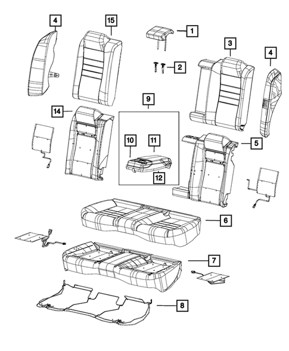

### 2C3CCAEG4HH586472 — rear-seats-second-row — diagram 2: Armrest Lid Hinge Pin
Source: https://www.moparamerica.com/v-2017-chrysler-300--c--3-6l-v6-flex/interior-trim--rear-seats-second-row?assembly=2
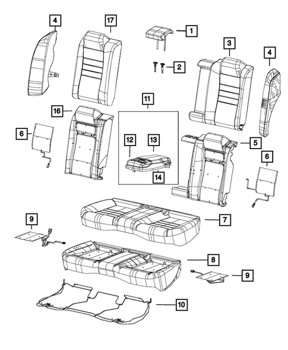

### 2C3CCAEG4HH586472 — rear-seats-second-row — diagram 3: Armrest Lid Hinge Pin
Source: https://www.moparamerica.com/v-2017-chrysler-300--c--3-6l-v6-flex/interior-trim--rear-seats-second-row?assembly=3

### 2C3CCAEG4HH586472 — rear-seats-second-row — diagram 4: Armrest Lid Hinge Pin
Source: https://www.moparamerica.com/v-2017-chrysler-300--c--3-6l-v6-flex/interior-trim--rear-seats-second-row?assembly=4

### 2C3CCAEG4HH586472 — rear-seats-second-row — diagram 5: Armrest Lid Hinge Pin
Source: https://www.moparamerica.com/v-2017-chrysler-300--c--3-6l-v6-flex/interior-trim--rear-seats-second-row?assembly=5
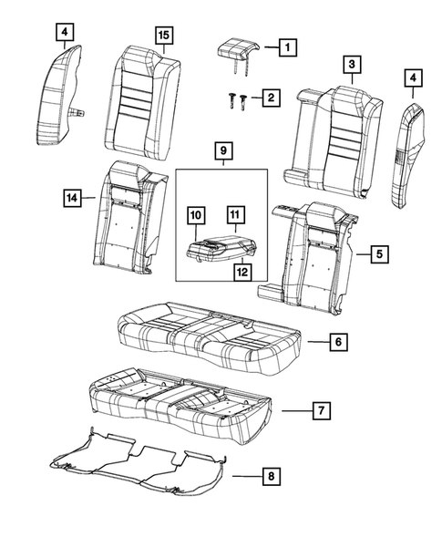

### 2C3CCAEG4HH586472 — rear-seats-second-row — diagram 6: Armrest Lid Hinge Pin
Source: https://www.moparamerica.com/v-2017-chrysler-300--c--3-6l-v6-flex/interior-trim--rear-seats-second-row?assembly=6

### 2C3CCAEG4HH586472 — rear-seats-second-row — diagram 7: Rear Headrest
Source: https://www.moparamerica.com/v-2017-chrysler-300--c--3-6l-v6-flex/interior-trim--rear-seats-second-row?assembly=7
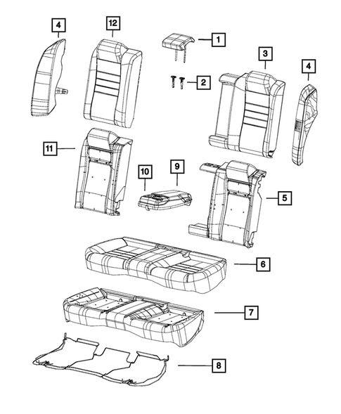

### 2C3CCAEG4HH586472 — rear-seats-second-row — diagram 8: Seat Bolster, Left
Source: https://www.moparamerica.com/v-2017-chrysler-300--c--3-6l-v6-flex/interior-trim--rear-seats-second-row?assembly=8

### 2C3CCAEG4HH586472 — rear-seats-second-row — diagram 9: Seat Bolster, Right
Source: https://www.moparamerica.com/v-2017-chrysler-300--c--3-6l-v6-flex/interior-trim--rear-seats-second-row?assembly=9

### 2C3CCAEG4HH586472 — rear-seats-second-row — diagram 10: Seat Bolster, Right
Source: https://www.moparamerica.com/v-2017-chrysler-300--c--3-6l-v6-flex/interior-trim--rear-seats-second-row?assembly=10

### 2C3CCAEG4HH586472 — seat-belts — diagram 1: Seat Belt Extender
Source: https://www.moparamerica.com/v-2017-chrysler-300--c--3-6l-v6-flex/restraints--seat-belts?assembly=1
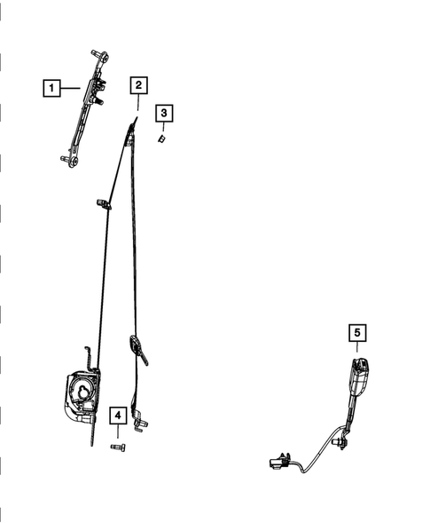

### 2C3CCAEG4HH586472 — seat-belts — diagram 2: Retractor Seat Belt
Source: https://www.moparamerica.com/v-2017-chrysler-300--c--3-6l-v6-flex/restraints--seat-belts?assembly=2
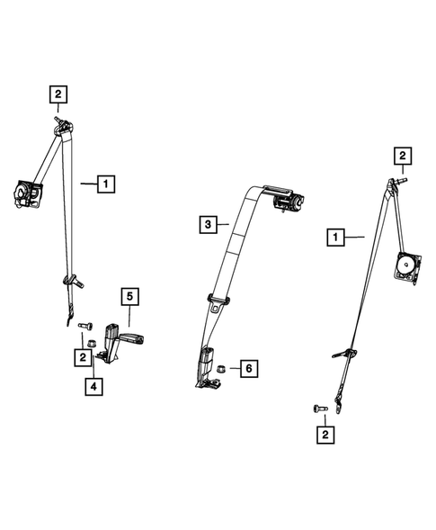

### 2C3CCAEG4HH586472 — air-bags — diagram 1: Screw
Source: https://www.moparamerica.com/v-2017-chrysler-300--c--3-6l-v6-flex/restraints--air-bags?assembly=1
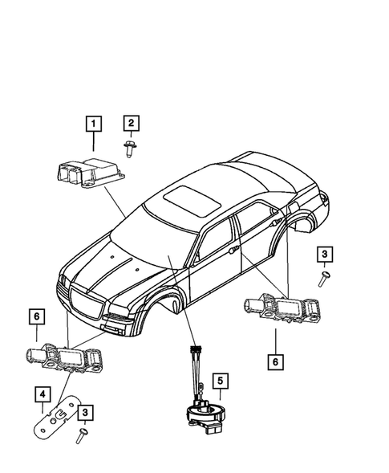

### 2C3CCAEG4HH586472 — air-bags — diagram 2: Side Curtain Air Bag, Right
Source: https://www.moparamerica.com/v-2017-chrysler-300--c--3-6l-v6-flex/restraints--air-bags?assembly=2
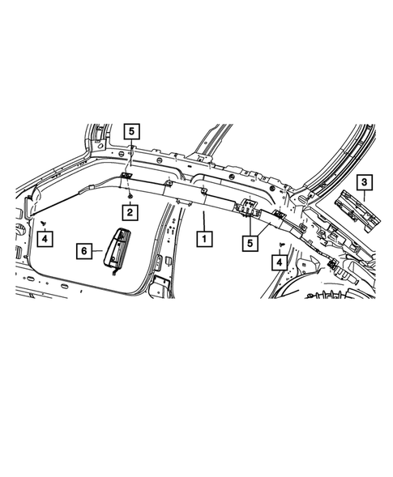

### 2C3CCAEG4HH586472 — air-bags — diagram 3: Passenger Air Bag
Source: https://www.moparamerica.com/v-2017-chrysler-300--c--3-6l-v6-flex/restraints--air-bags?assembly=3
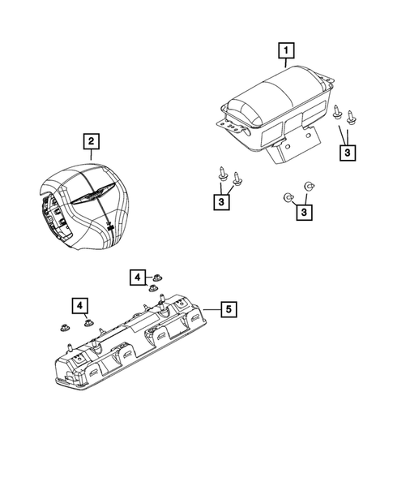

### 2C3CCAEG4HH586472 — steering-column — diagram 1: Steering Column 19
Source: https://www.moparamerica.com/v-2017-chrysler-300--c--3-6l-v6-flex/steering--steering-column-and-intermediate-shaft
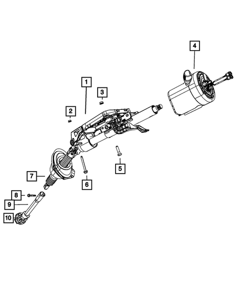

### 2C3CCAEG4HH586472 — steering-wheel — diagram 1: Steering Wheel
Source: https://www.moparamerica.com/v-2017-chrysler-300--c--3-6l-v6-flex/steering--steering-wheel?assembly=1
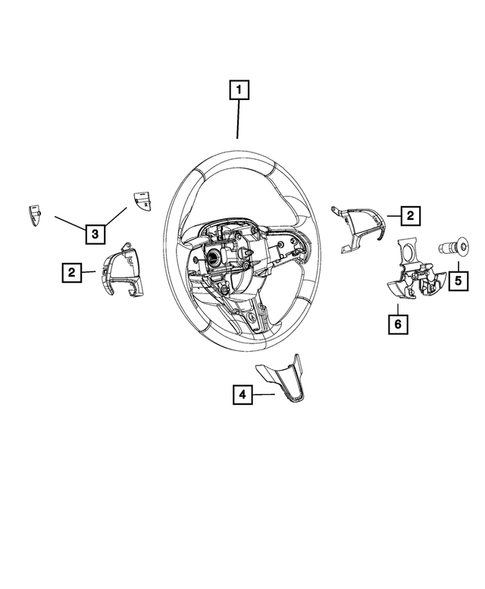

### 2C3CCAEG4HH586472 — steering-wheel — diagram 2: Steering Wheel
Source: https://www.moparamerica.com/v-2017-chrysler-300--c--3-6l-v6-flex/steering--steering-wheel?assembly=2
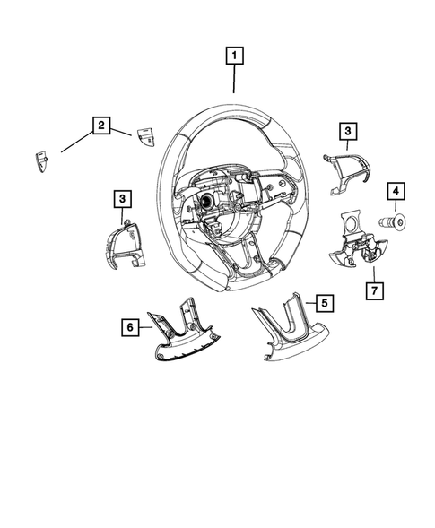

### 2C3CCAEG4HH586472 — instrument-panel — diagram 1: Instrument Panel Closeout Panel, Left, Inboard 122
Source: https://www.moparamerica.com/v-2017-chrysler-300--c--3-6l-v6-flex/interior-trim--instrument-panel
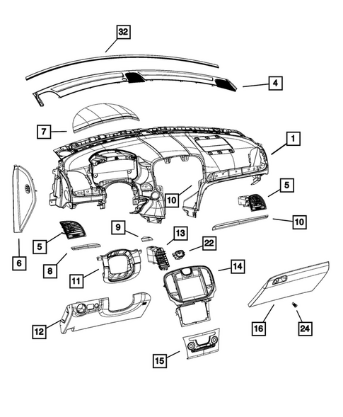

## Limitations and next evidence needed
1. Obtain OEM build sheets/sales-code lists for both VINs.
2. Run a dealer/OEM VIN-specific part query for the exact left/right, colour, trim, seat-option and restraint sales codes.
3. Verify physical labels/part numbers and installation photographs for seats, belts, airbags, steering column and child-restraint anchorages.
4. Use test reports/approval evidence for ADR performance; do not substitute this catalog comparison for crash, anchorage or dynamic-test evidence.
5. Resolve the two scraper gaps recorded in `extracted/mopar/errors.json` if an additional catalog route becomes available.
